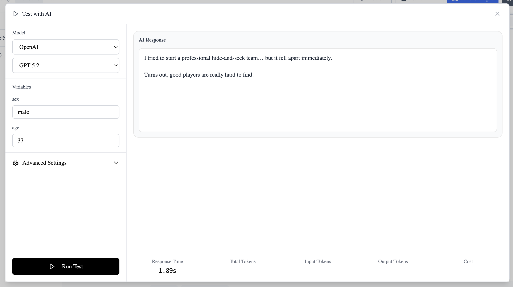
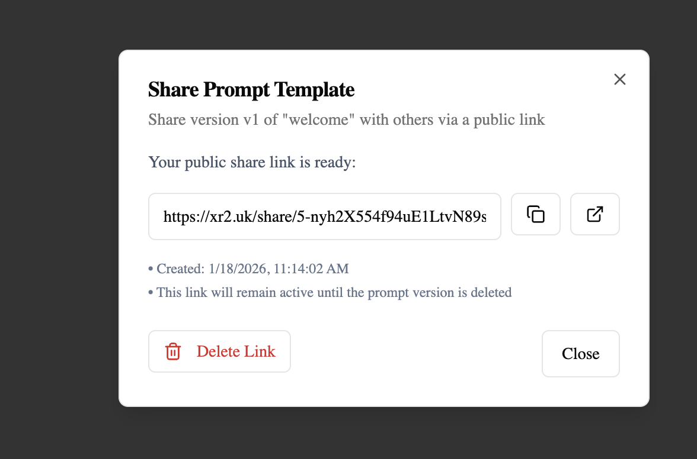

---
---

# Prompt Editor Overview

The xR2 Prompt Editor is a powerful visual tool for creating, editing, and managing AI prompts. It provides everything you need to iterate on prompts without touching your codebase.

## Editor Layout

The editor is divided into two main areas:

### Left Panel — Metadata & Settings

- **Basic Settings** — Where you can set description, name, or slug
- **Variables** — Define and manage dynamic variables
- **Tags** — Organize prompts with colored labels
- **Version History** — Browse and restore previous versions
- **Performance Stats** — View usage metrics

### Center Panel — Content Editor

A Monaco-based code editor (same as VS Code) with:

- Syntax highlighting
- Three tabs: System, User prompts
- Full-screen mode
- Font size adjustment
- Copy functionality

## Prompt Types

Each prompt can have two components:

| Type | Purpose | Example |
|------|---------|---------|
| **System Prompt** | Define AI behavior and personality | "You are a helpful assistant that speaks formally." |
| **User Prompt** | Template for user input with variables | "Help {{user_name}} with: {{question}}" |

## Key Features

### Visual Variable Detection

The editor automatically detects variables in `{{variable_name}}` format and displays them in the left panel for configuration.

### Fullscreen Mode

Click the fullscreen icon to expand the editor to full screen. Features:

- Distraction-free editing environment
- Collapsible variable panel on the right
- Font size controls (10px-32px)
- Markdown syntax highlighting
- Preview mode for rendered content
- Copy all functionality
- Keyboard shortcuts: `⌘S` to save, `Escape` to exit

### Real-time Testing

Test your prompts directly in the editor with any LLM provider (OpenAI, Anthropic, Google, etc.) and see streaming responses.

### Deployment Pipeline

Deploy versions to production instantly. Track who deployed what and when.

### Share Versions

Share specific prompt versions with team members or external stakeholders:

1. Open the version you want to share
2. Click the **Share** button (located in the left part of the editor in the version list)
3. A unique public link is generated
4. Recipients can view (read-only):
    - Prompt content (system, user, assistant)
    - Variable definitions
    - Metadata (created by, dates)
5. Links can be deactivated

## Keyboard Shortcuts

| Shortcut        | Action                    |
|-----------------|---------------------------|
| `⌘S` / `Ctrl+S` | Save changes              |
| `⌘P` / `Ctrl+P` | Deploy and Undeploy prompt |

## Next Steps

- [Creating Prompts](creating-prompts.md) — Learn how to create new prompts
- [Variables](variables.md) — Master dynamic content
- [Versions](versions.md) — Manage versions and deploy
