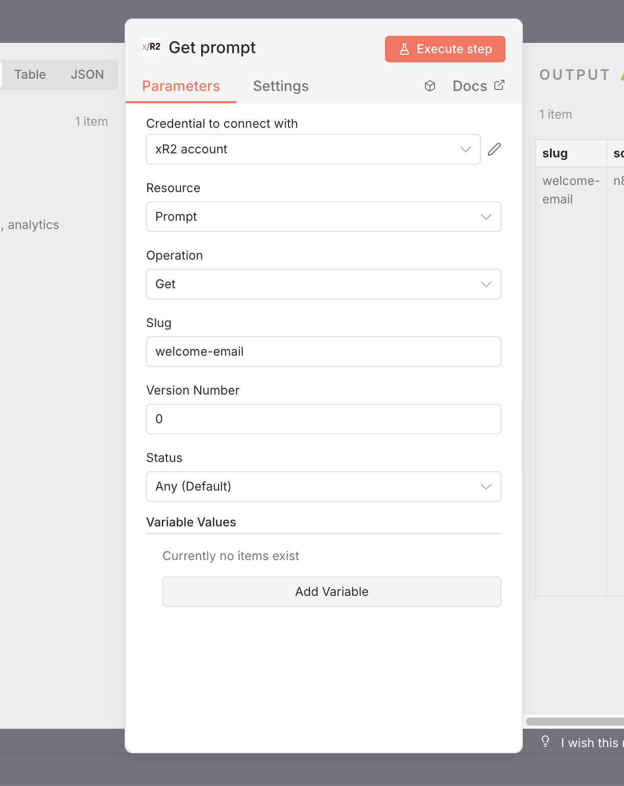
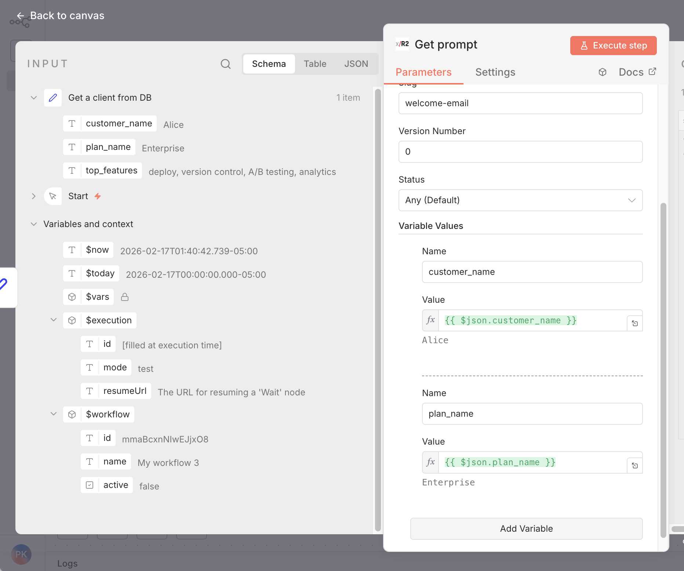

# n8n Integration

Community node for n8n that integrates with the xR2 API.

[](https://www.npmjs.com/package/n8n-nodes-xr2)

## Installation

### Via n8n GUI (Recommended)

1. Go to **Settings** → **Community Nodes**
2. Click **Install**
3. Enter `n8n-nodes-xr2`
4. Click **Install**
5. Restart n8n

### Manual Installation

```bash
cd ~/.n8n/custom
npm install n8n-nodes-xr2
```

## Setup Credentials

1. In n8n, go to **Settings** → **Credentials**
2. Click **New** → search for "xR2 API"
3. Paste your API key (from [xr2.uk/api-keys](https://xr2.uk/api-keys))
4. Click **Save**

## Available Operations

| Resource | Operation | Description |
|----------|-----------|-------------|
| API Key | Check | Validate API key |
| Prompt | Get | Fetch prompt by slug |
| Event | Track | Send analytics event |

## Get Prompt

Fetches a prompt from xR2.

**Parameters:**

| Parameter | Required | Description |
|-----------|----------|-------------|
| Slug | Yes | Prompt identifier |
| Version Number | No | Specific version (0 = latest) |
| Status | No | `production`, `testing`, `draft`, etc. |
| Variable Values | No | Key-value pairs to replace `{{variable}}` placeholders |

**Output:**

```json
{
  "slug": "welcome",
  "system_prompt": "You are a helpful assistant",
  "user_prompt": "Hello {{name}}",
  "variables": [...],
  "trace_id": "evt_xxx",
  "version_number": 2,
  "status": "production"
}
```

If Variable Values are provided, `{{placeholders}}` in prompt fields are replaced with the given values and a `variables_used` field is added to the output.

## Rendering Variables

The xR2 node can replace `{{variable}}` placeholders directly — no Code node needed.

1. Add an **xR2** node with **Get Prompt** operation
2. Click **Add Variable** under **Variable Values**
3. For each variable, set **Name** (e.g. `customer_name`) and **Value**



Values support n8n expressions, so you can pull data from previous nodes:



| Name | Value |
|------|-------|
| `customer_name` | `{{ $json.customer_name }}` |
| `plan_name` | `{{ $json.plan_name }}` |
| `language` | `en` |

If a variable is not provided, its **default value** from the prompt definition is used automatically.

**Output with variables rendered:**

```json
{
  "slug": "welcome",
  "system_prompt": "You are a helpful assistant for Alice on the Enterprise plan.",
  "user_prompt": "Generate a welcome email for the new user.",
  "variables_used": {
    "customer_name": "Alice",
    "plan_name": "Enterprise"
  },
  "trace_id": "evt_xxx"
}
```

> **Tip:** Leave Variable Values empty to get the raw template with `{{placeholders}}` — useful if you want to handle rendering yourself.

## Track Event

Sends an analytics event to xR2.

**Parameters:**

| Parameter | Required | Description |
|-----------|----------|-------------|
| Trace ID | Yes | From Get Prompt response |
| Event Name | Yes | Event name from dashboard |
| User ID | No | User identifier |
| Session ID | No | Session identifier |
| Value | No | Numeric value |
| Currency | No | Currency code |
| Metadata | No | JSON object |

## Example Workflow

### Basic Flow

```
[Manual Trigger] → [xR2: Get Prompt] → [xR2: Track Event]
```

1. **xR2 Node** (Get Prompt):
   - Slug: `welcome`

2. **xR2 Node** (Track Event):
   - Trace ID: `{{ $('xR2').item.json.trace_id }}`
   - Event Name: `sign_up`
   - User ID: `user_123`

### With OpenAI

```
[Webhook] → [xR2: Get Prompt] → [OpenAI] → [xR2: Track Event]
```

1. Get the prompt from xR2 (with Variable Values filled in)
2. Use rendered `system_prompt` and `user_prompt` in OpenAI node
3. Track conversion event

### With variables from a database

```
[DB Query] → [xR2: Get Prompt] → [LLM Node] → [xR2: Track Event]
```

1. Query your database for user data
2. In xR2 node, map variables: `customer_name` → `{{ $json.customer_name }}`, etc.
3. The node returns prompts with all placeholders replaced
4. Pass directly to any LLM node

## Accessing Data in Expressions

```javascript
// Get prompt content (rendered if variables were provided)
{{ $('xR2').item.json.user_prompt }}

// Get trace_id
{{ $('xR2').item.json.trace_id }}

// Get variables used (when Variable Values were provided)
{{ $('xR2').item.json.variables_used }}

// Get variable definitions
{{ $('xR2').item.json.variables }}
```

## Troubleshooting

### Node not appearing

* Restart n8n after installation
* Check `~/.n8n/custom/node_modules/` for the package
* Run `n8n start --verbose` to see errors

### Authentication error

* Verify API key is correct
* Ensure key starts with `xr2_prod_`
* Check key is active in dashboard

### Prompt not found

* Verify slug exists at [xr2.uk/prompts](https://xr2.uk/prompts)
* Ensure prompt has a deployed version
* Check spelling

## Links

* npm: [https://www.npmjs.com/package/n8n-nodes-xr2](https://www.npmjs.com/package/n8n-nodes-xr2)
* n8n Community: [https://community.n8n.io](https://community.n8n.io)
