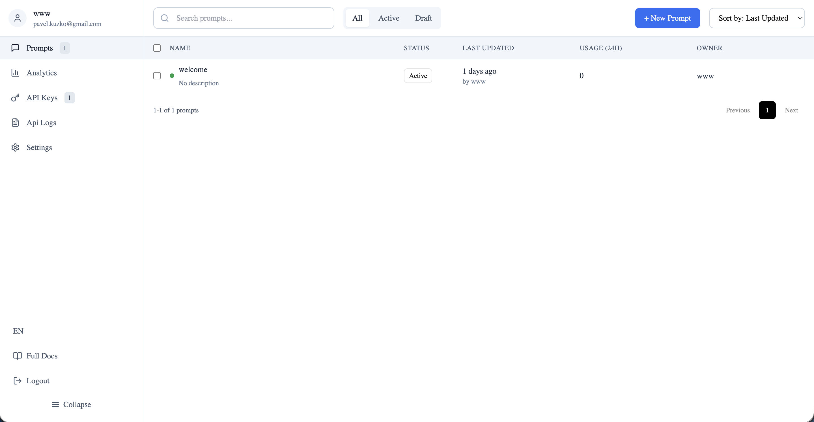
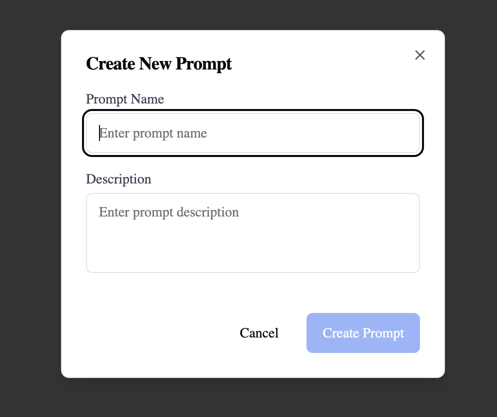
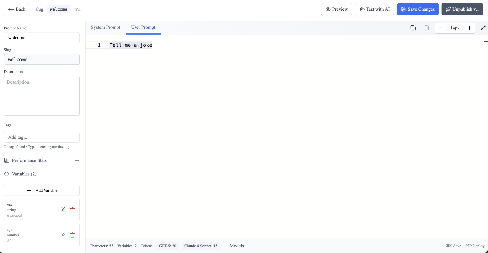
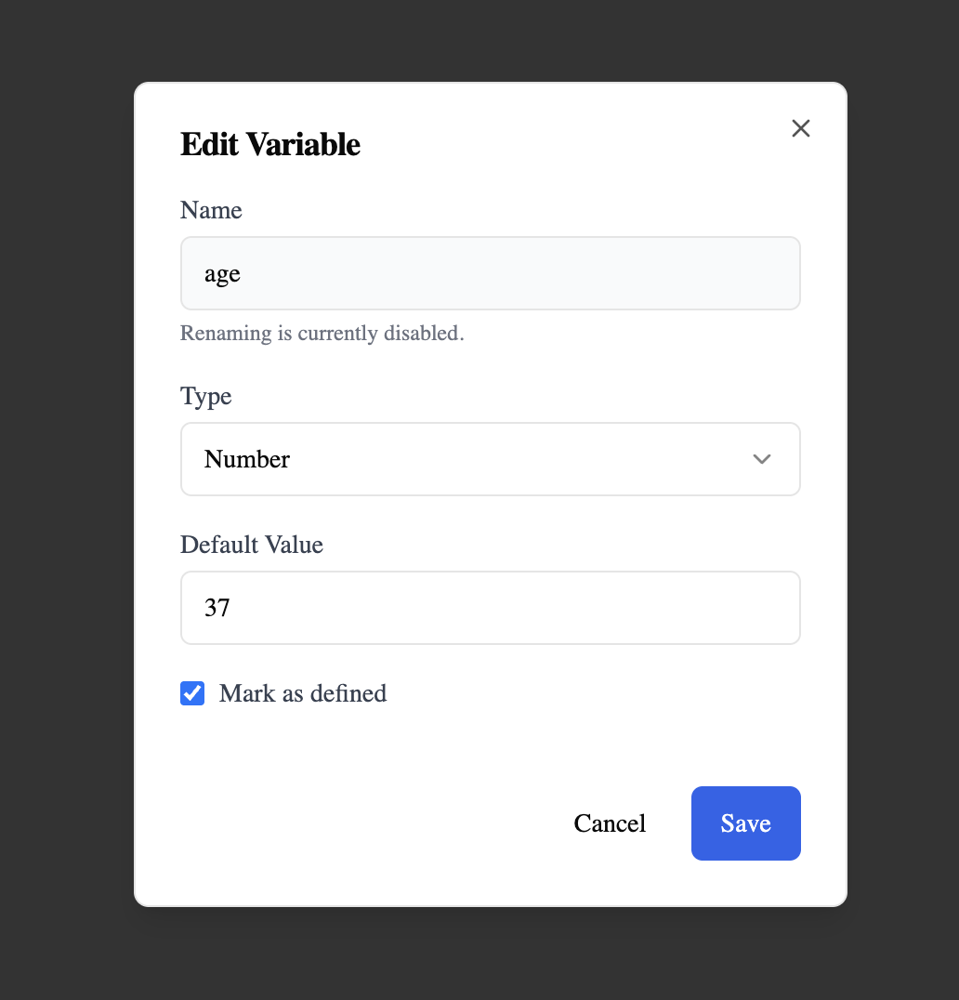

# Быстрый старт

Начните работу с xR2 за 5 минут. Это руководство проведёт вас через создание первого промпта и интеграцию в ваше приложение.

## Шаг 1: Создайте аккаунт

1. Перейдите на [xr2.uk](https://xr2.uk)
2. Нажмите **Sign Up**
3. Зарегистрируйтесь через Google
4. Вы будете перенаправлены на главный экран



## Шаг 2: Создайте первый промпт

1. На странице нажмите **+ New Prompt**
2. Заполните поля:
    - **Name**: Понятное название (например, "Ассистент поддержки")
    - **Description**: Описание промпта (необязательное поле)
3. Нажмите **Create Prompt**


## Шаг 3: Напишите промпт


Редактор имеет три секции:

### System Prompt

Инструкции, определяющие поведение AI:

```
You are a helpful customer support assistant for an e-commerce store.
Be friendly, concise, and always offer to help with returns or exchanges.
```

### User Prompt

Шаблон для сообщений пользователя. Используйте `{{переменные}}` для динамического контента:

```
Customer name: {{customer_name}}
Order ID: {{order_id}}

Customer message: {{message}}

Please help this customer with their inquiry.
```

### Переменные

Редактор автоматически определяет переменные вроде `{{customer_name}}`. Перейдите в левом меню в "Переменный", чтобы:

- Установить **тип** (string, number, boolean)
- Добавить **значение по умолчанию**
- Отметить переменную как **обязательную**



## Шаг 4: Протестируйте промпт (если хотите)

1. Нажмите кнопку **Test with AI**
2. В окне тестирования:
    - Выберите провайдера LLM (OpenAI, Anthropic и др.)
    - Выберите модель
    - Заполните значения переменных
    - Нажмите **Run**
3. Смотрите ответ AI в реальном времени со стримингом

> ℹ️ **Инфо:** При первом тестировании нужно добавить ваш API-ключ LLM. Для тестирования вы используется свои настройки. Мы храним ваши ключи в зашифрованном ввиде и не имеют досутп к ним.

## Шаг 5: Деплой в продакшн

Когда промпт готов:

1. Нажмите **Publish** для публикации
2. Статус версии изменится на **Production**

Теперь ваш промпт доступен через API.

## Шаг 6: Получите API-ключ

1. Перейдите в [API Keys](https://xr2.uk/api-keys) в боковом меню
2. Нажмите **+ New API Key**
3. Скопируйте ваш **API Key** (начинается с `xr2_prod_`)

## Шаг 7: Интегрируйте в приложение

Вызовите API xR2 для получения промпта:

```bash
curl -X POST https://xr2.uk/api/v1/get-prompt \
  -H "Authorization: Bearer xr2_prod_xxx" \
  -H "Content-Type: application/json" \
  -d '{
    "slug": "customer-support",
    "source_name": "web_app"
  }'
```

**Ответ:**

```json
{
  "slug": "customer-support",
  "system_prompt": "You are a helpful customer support assistant...",
  "user_prompt": "Customer name: {{customer_name}}...",
  "variables": [...],
  "trace_id": "evt_abc123_1234567890_xyz"
}
```

Используйте промпты с вашей LLM и сохраните `trace_id` для аналитики.

## Шаг 8: Отслеживание событий (опционально)

Когда происходит важное событие (регистрация, покупка и т.д.), отправьте его:

```bash
curl -X POST https://xr2.uk/api/v1/events \
  -H "Authorization: Bearer xr2_prod_xxx" \
  -H "Content-Type: application/json" \
  -d '{
    "trace_id": "evt_abc123_1234567890_xyz",
    "event_name": "purchase_completed",
    "source_name": "web_app",
    "user_id": "user_123",
    "value": 99.99,
    "currency": "USD"
  }'
```

Это связывает конверсию с вашим промптом для аналитики.

## Что дальше?

- [Редактор промптов](../prompts/overview.md) — Освойте визуальный редактор
- [Аналитика](../analytics/overview.md) — Настройте отслеживание событий
- [A/B тестирование](../ab-testing/overview.md) — Сравнивайте версии промптов
