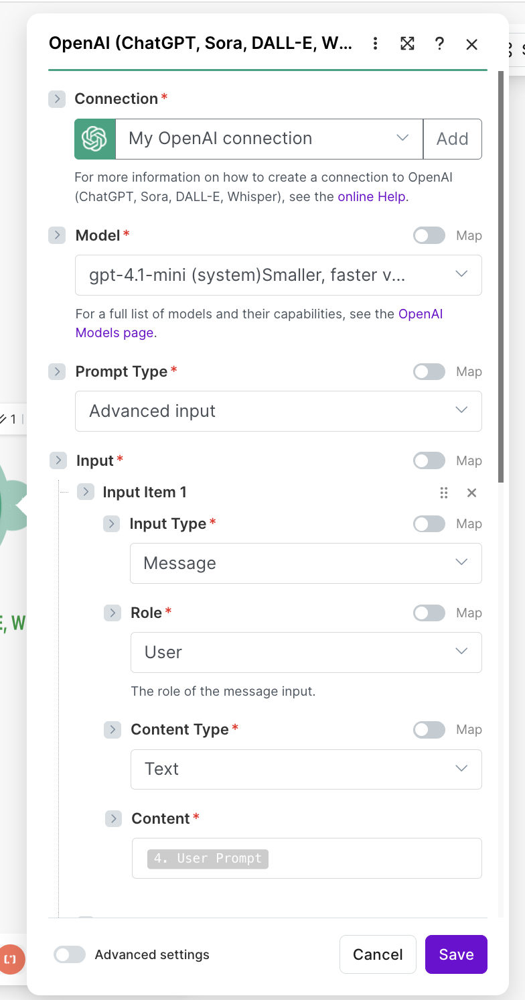
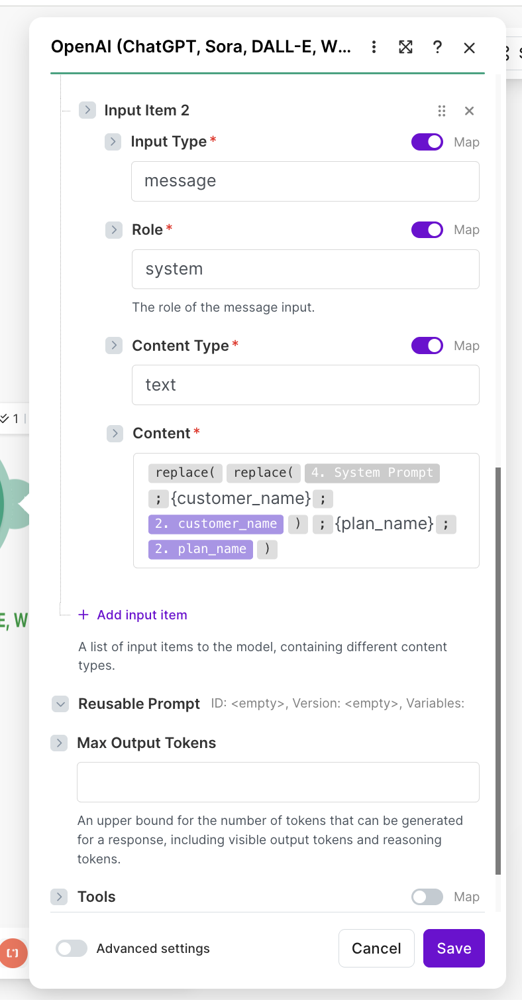
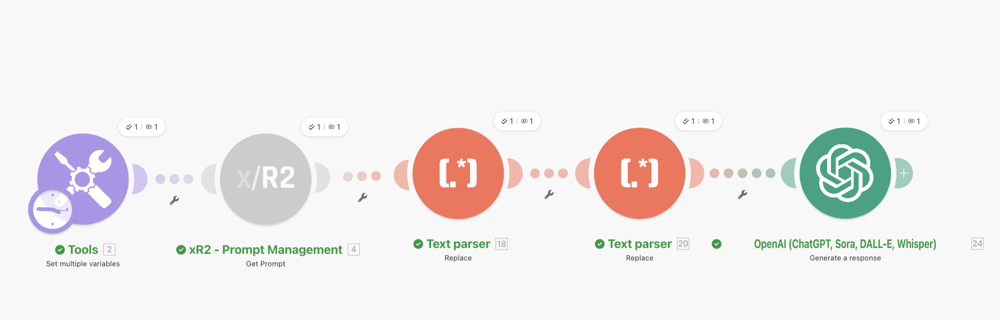
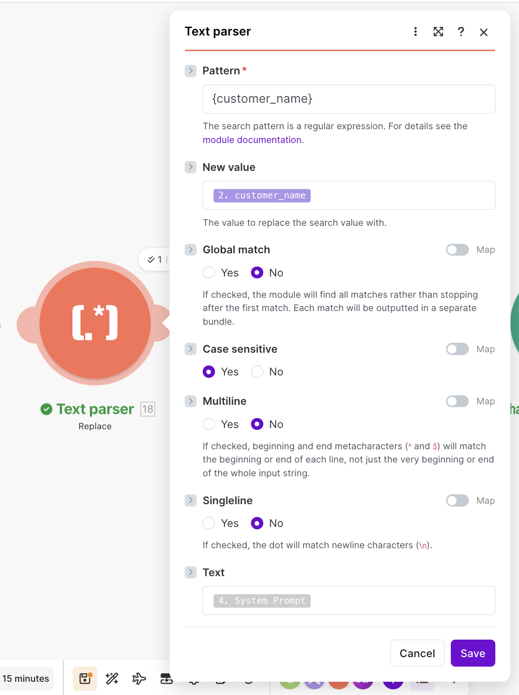
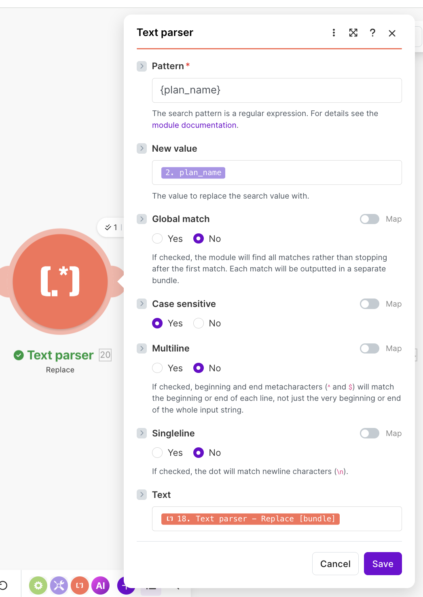
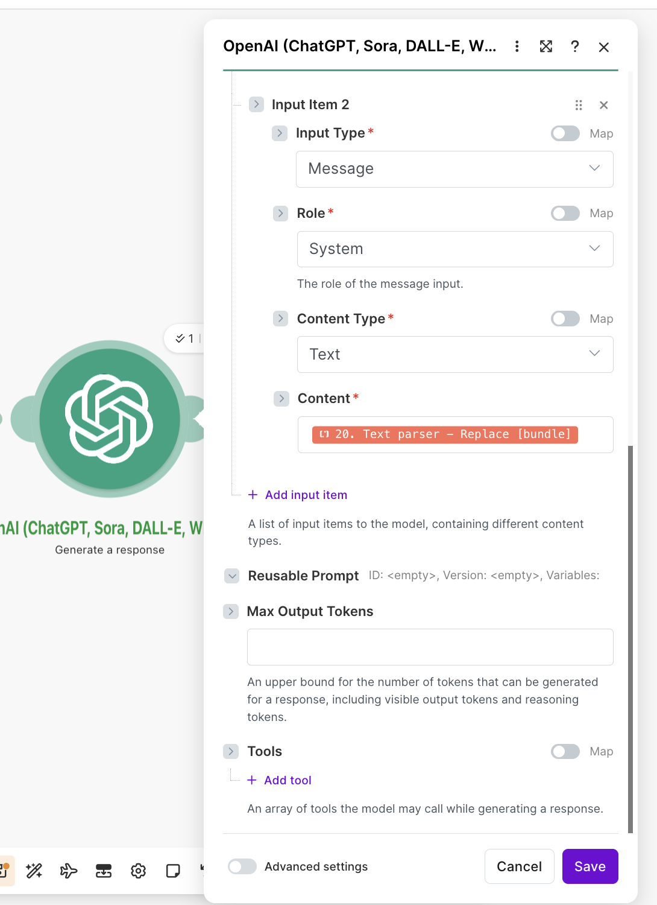

# Интеграция с Make.com

Официальная интеграция Make.com (Integromat) для xR2.

## Установка

Приложение xR2 находится на ревью в Make.com и скоро будет доступно в маркетплейсе. После публикации вы сможете найти его в списке приложений Make.com по запросу "xR2".

А пока вы можете настроить интеграцию вручную (см. ниже).

### Ручная настройка (Custom App)

1. Перейдите на [eu2.make.com/apps](https://eu2.make.com/apps)
2. Создайте новое пользовательское приложение с названием "xR2"
3. Настройте Base, Connection и Modules (см. ниже)

## Конфигурация (для ручной настройки)

### Шаг 1: Base

Перейдите в **Base** и вставьте:

```json
{
    "baseUrl": "https://xr2.uk/api/v1",
    "headers": {
        "Content-Type": "application/json",
        "Accept": "application/json"
    },
    "log": {
        "sanitize": ["request.headers.authorization"]
    },
    "response": {
        "error": {
            "message": "{{body.detail.message}}",
            "type": "{{body.detail.error}}"
        }
    }
}
```

### Шаг 2: Connection

Перейдите в **Connections** → **Add Connection** и вставьте:

```json
{
    "name": "xr2_api_key",
    "label": "xR2 API Key Connection",
    "type": "apikey",
    "parameters": [
        {
            "name": "apiKey",
            "type": "text",
            "label": "API Key",
            "help": "Enter your xR2 Product API Key from https://xr2.uk/api-keys",
            "required": true
        }
    ],
    "common": {
        "headers": {
            "Authorization": "Bearer {{parameters.apiKey}}"
        }
    },
    "test": {
        "request": {
            "url": "/check-api-key",
            "method": "GET"
        },
        "response": {
            "valid": "{{body.ok}}"
        }
    }
}
```

### Шаг 3: Modules

Добавьте три модуля из JSON-файлов в репозитории SDK:

* `modules/checkApiKey.json` - Проверка API-ключа
* `modules/getPrompt.json` - Получение промпта
* `modules/trackEvent.json` - Отслеживание события

## Доступные модули

### Проверка API-ключа

Проверяет валидность вашего API-ключа.

**Вывод:**
```json
{
  "ok": true,
  "user": "your_username"
}
```

### Получение промпта

Получает содержимое промпта по slug-идентификатору.

| Параметр | Тип | Обязательный | Описание |
|----------|-----|--------------|----------|
| slug | string | Да | Идентификатор промпта |
| version_number | integer | Нет | Конкретная версия |
| status | select | Нет | Фильтр по статусу |

**Вывод:**
```json
{
  "slug": "welcome",
  "system_prompt": "You are a helpful assistant",
  "user_prompt": "Hello {{name}}",
  "trace_id": "evt_xxx",
  "variables": [...]
}
```

### Подстановка переменных

Модуль Get Prompt возвращает шаблоны с плейсхолдерами `{переменная}`. Есть два способа заменить их на реальные значения перед отправкой в LLM.

#### Вариант 1: функция replace() (рекомендуется для нескольких переменных)

Используйте функцию `replace()` прямо в поле Content модуля OpenAI. Сначала задайте значения переменных в модуле **Tools: Set Multiple Variables**, затем используйте `replace()` в маппинге LLM-модуля:

```
{{replace(replace(4.system_prompt; "{customer_name}"; 2.customer_name); "{plan_name}"; 2.plan_name)}}
```

Где `4` — номер модуля Get Prompt, а `2` — номер модуля Set Variables.





#### Вариант 2: модули Text Parser (визуально, без формул)

Используйте модули **Text Parser: Replace** между Get Prompt и OpenAI. Каждый модуль заменяет одну переменную. Текст передаётся от модуля к модулю, и на каждом шаге заменяется ещё одна переменная.

```
[Tools] → [xR2: Get Prompt] → [Text Parser: Replace] → [Text Parser: Replace] → [OpenAI]
```



**Первый Text Parser** — заменяет `{customer_name}`:
- **Pattern**: `{customer_name}`
- **New value**: маппинг на `customer_name` из модуля Tools
- **Text**: маппинг на `System Prompt` из модуля xR2



**Второй Text Parser** — заменяет `{plan_name}`:
- **Pattern**: `{plan_name}`
- **New value**: маппинг на `plan_name` из модуля Tools
- **Text**: маппинг на результат **первого** Text Parser



**Модуль OpenAI** — использует результат **последнего** Text Parser как System Prompt:



> **Совет:** Значения по умолчанию доступны в выводе Get Prompt в поле `variables[].defaultValue`.

### Отслеживание события

Отправляет аналитические события.

| Параметр | Тип | Обязательный | Описание |
|----------|-----|--------------|----------|
| trace_id | string | Да | Из Get Prompt |
| event_name | string | Да | Название события |
| user_id | string | Нет | Идентификатор пользователя |
| session_id | string | Нет | Идентификатор сессии |
| value | number | Нет | Числовое значение |
| currency | string | Нет | Код валюты |
| metadata | collection | Нет | Произвольные поля |

## Примеры сценариев

### Базовый сценарий

```
[Manual Trigger] → [xR2: Check API Key] → [xR2: Get Prompt] → [xR2: Track Event]
```

1. **Check API Key**: Проверка учетных данных
2. **Get Prompt**: slug = `welcome`
3. **Track Event**:
   * Trace ID: `{{2.trace_id}}`
   * Event Name: `sign_up`
   * User ID: `user_123`

### С OpenAI

```
[Webhook] → [xR2: Get Prompt] → [OpenAI] → [xR2: Track Event]
```

1. Получите промпт из xR2
2. Отправьте в OpenAI, используя содержимое промпта
3. Отследите событие конверсии с выручкой

**Настройки Track Event:**
* Trace ID: `{{1.trace_id}}`
* Event Name: `purchase_completed`
* Value: `99.99`
* Currency: `USD`

## Устранение неполадок

### Тест подключения не проходит

* Проверьте API-ключ на [xr2.uk/api-keys](https://xr2.uk/api-keys)
* Убедитесь, что в заголовках указано `Authorization: Bearer {{parameters.apiKey}}`

### Модуль не отправляет JSON

* Добавьте в communication.body: `"type": "json"`

### Опциональные параметры отправляются как null

* Используйте: `"{{if(parameters.field, parameters.field)}}"`

## Ссылки

* Make.com: [https://make.com](https://make.com)
* Дашборд xR2: [https://xr2.uk](https://xr2.uk)
