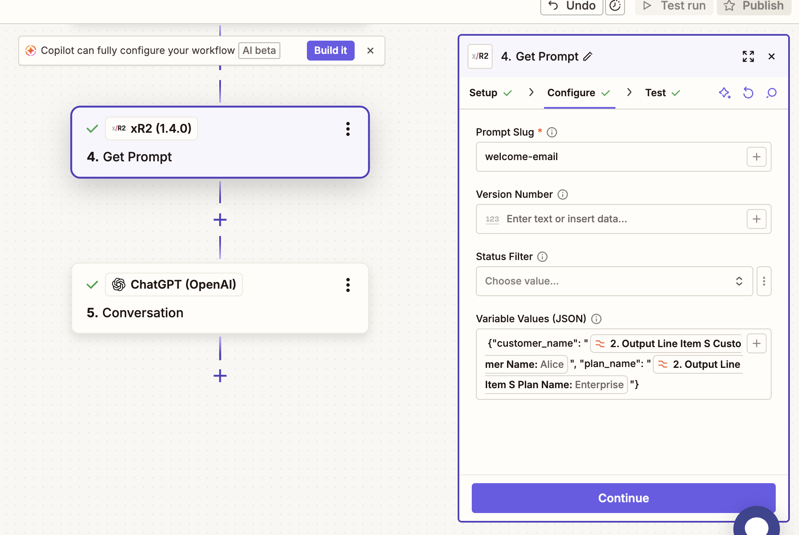
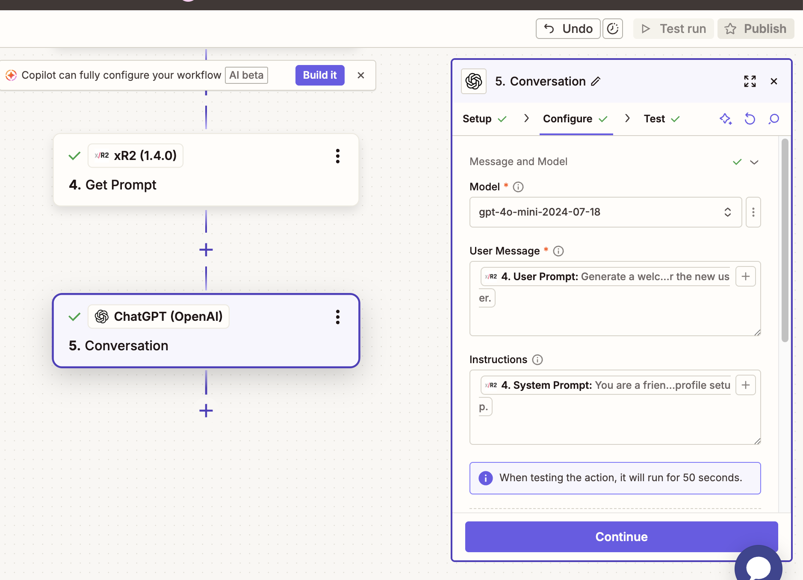

# Интеграция с Zapier

Официальная интеграция Zapier для xR2.

## Установка

Установите интеграцию xR2 для Zapier по этой пригласительной ссылке:

**[Установить xR2 для Zapier](https://zapier.com/developer/public-invite/234012/76d33482ff8db5ed0f78871a90dfed37/)**

## Настройка

1. Перейдите по ссылке выше и примите приглашение
2. Получите ваш API-ключ на [xr2.uk/api-keys](https://xr2.uk/api-keys)
3. Нажмите **Create Keys** и скопируйте ваш Product API Key (начинается с `xr2_prod_`)
4. В Zapier подключите xR2, используя ваш API-ключ

## Доступные действия

### Проверка API-ключа

Проверяет валидность вашего API-ключа и возвращает имя пользователя.

**Вывод:**
```json
{
  "ok": true,
  "user": "your_username"
}
```

### Получение промпта

Получает промпт из xR2 по slug-идентификатору. Может автоматически подставлять переменные.

**Параметры:**

| Параметр | Обязательный | Описание |
|----------|--------------|----------|
| Slug | Да | Уникальный идентификатор промпта |
| Version Number | Нет | Конкретная версия для получения |
| Status | Нет | Фильтр по статусу |
| Variable Values (JSON) | Нет | JSON со значениями для замены `{переменных}` |

**Вывод:**
* System prompt (с подставленными переменными, если указан Variable Values)
* User prompt (с подставленными переменными, если указан Variable Values)
* Assistant prompt
* Variables
* trace_id
* variables_used (если указан Variable Values)
* Model config
* Информация об A/B-тесте

### Подстановка переменных

Действие xR2 для Zapier может заменять `{переменные}` напрямую — дополнительные шаги не нужны.

В поле **Variable Values (JSON)** введите JSON-объект с именами переменных и их значениями:

```json
{"customer_name": "Alice", "plan_name": "Enterprise", "top_features": "deploy, analytics"}
```

Можно использовать маппинг полей Zapier для вставки динамических значений из предыдущих шагов, нажав **+** и выбрав поля из ранних шагов:



Затем замапьте готовые `System Prompt` и `User Prompt` из шага xR2 напрямую в шаг OpenAI Conversation:



Если переменная не указана, автоматически используется её **значение по умолчанию** из определения промпта.

**Вывод с подставленными переменными:**

```json
{
  "system_prompt": "Write a welcome email for Alice on the Enterprise plan.",
  "user_prompt": "Generate a welcome email for the new user.",
  "variables_used": {
    "customer_name": "Alice",
    "plan_name": "Enterprise"
  },
  "trace_id": "evt_xxx"
}
```

> **Совет:** Оставьте Variable Values пустым, чтобы получить сырой шаблон с `{плейсхолдерами}`.

### Отслеживание события

Отправляет аналитические события, связанные с запросом промпта.

**Параметры:**

| Параметр | Обязательный | Описание |
|----------|--------------|----------|
| Trace ID | Да | Из ответа Get Prompt |
| Event Name | Да | Название события из дашборда |
| User ID | Нет | Идентификатор пользователя |
| Session ID | Нет | Идентификатор сессии |
| Value | Нет | Числовое значение для выручки |
| Currency | Нет | Код валюты (USD, EUR) |
| Metadata | Нет | JSON-объект с произвольными полями |

## Пример Zap

### Базовый: Форма → AI-ответ → Отслеживание

```
[New Form Submission] → [xR2: Get Prompt] → [OpenAI] → [xR2: Track Event]
```

1. **Триггер**: Новая отправка формы (Typeform, Google Forms и т.д.)
2. **xR2 Get Prompt**:
   * Slug: `customer-support`
3. **OpenAI**:
   * Используйте system_prompt и user_prompt из xR2
   * Заполните переменные данными из формы
4. **xR2 Track Event**:
   * Trace ID: из шага 2
   * Event Name: `ai_response_generated`
   * User ID: из email формы

### Отслеживание выручки

```
[New Order] → [xR2: Get Prompt] → [xR2: Track Event]
```

Отслеживайте покупки, связанные с AI-взаимодействиями:

1. **Триггер**: Новый заказ Shopify/Stripe
2. **xR2 Get Prompt**: Получите промпт, использованный для этого клиента
3. **xR2 Track Event**:
   * Trace ID: сохраненный из начального взаимодействия
   * Event Name: `purchase_completed`
   * Value: сумма заказа
   * Currency: `USD`
   * User ID: email клиента

## Сопоставление полей

Используйте маппер полей Zapier для связи данных между шагами:

```
Trace ID: {{steps.xr2_get_prompt.trace_id}}
User Prompt: {{steps.xr2_get_prompt.user_prompt}}
System Prompt: {{steps.xr2_get_prompt.system_prompt}}
```

## Устранение неполадок

### Ошибка аутентификации

* Убедитесь, что API-ключ корректен
* Убедитесь, что ключ начинается с `xr2_prod_`
* Проверьте, что ключ активен на [xr2.uk/api-keys](https://xr2.uk/api-keys)

### Промпт не найден

* Проверьте, что slug существует на [xr2.uk/prompts](https://xr2.uk/prompts)
* Убедитесь, что у промпта есть развернутая версия
* Проверьте правильность написания slug

### Событие не отслеживается

* Убедитесь, что название события определено в [настройках аналитики](https://xr2.uk/analytics/events)
* Убедитесь, что trace_id корректно сопоставлен из шага Get Prompt
* Проверьте, что обязательные поля метаданных заполнены

## Ссылки

* Zapier: [https://zapier.com](https://zapier.com)
* Дашборд xR2: [https://xr2.uk](https://xr2.uk)
* Поддержка: hello@xr2.uk
